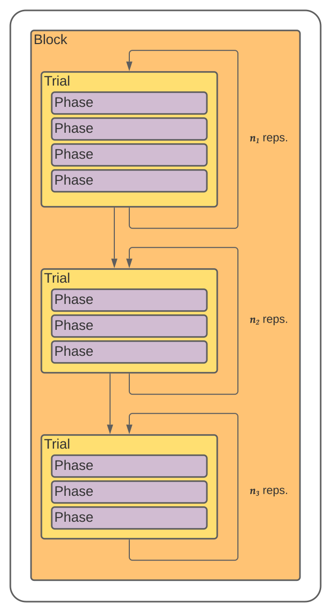
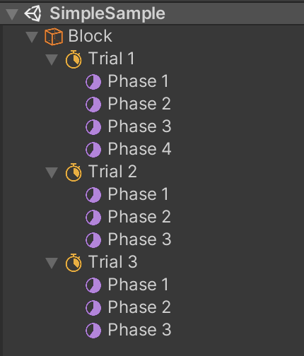
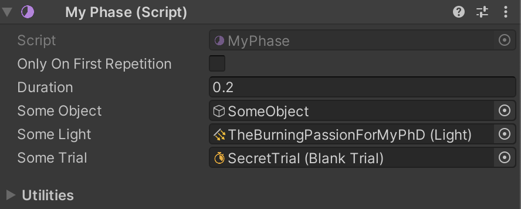
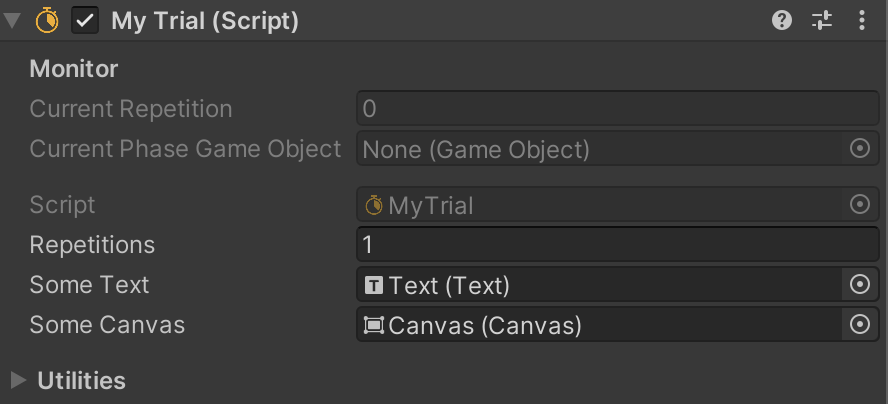
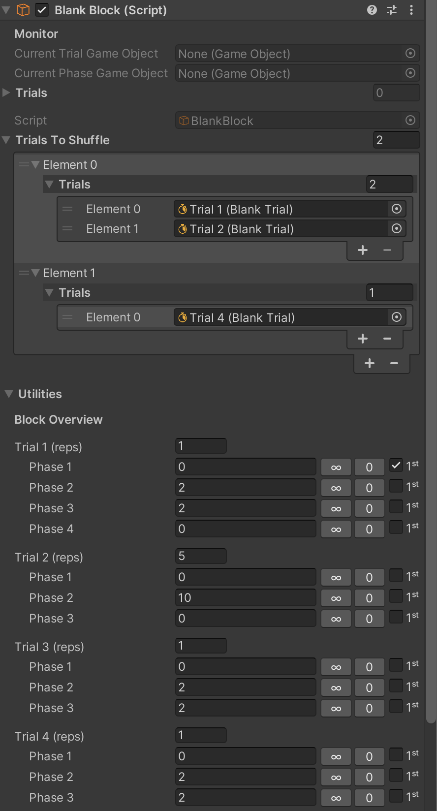
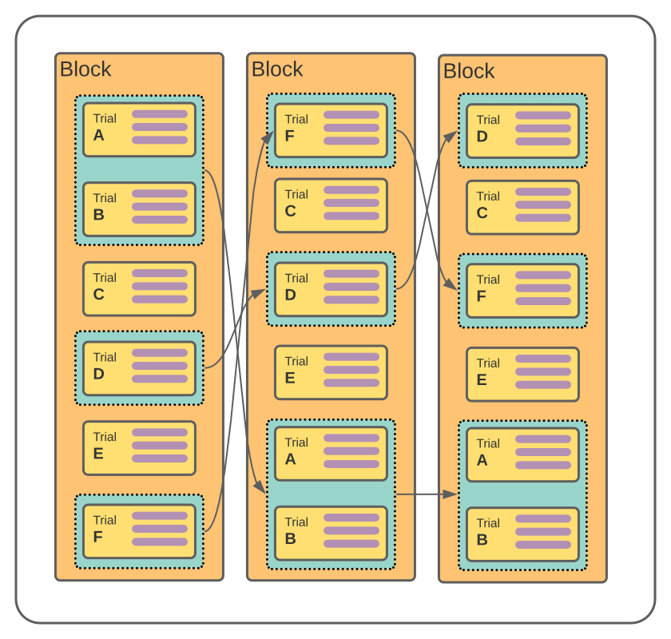
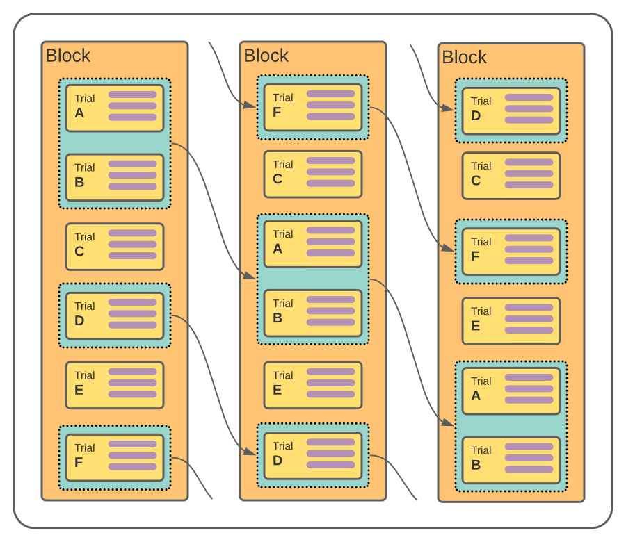
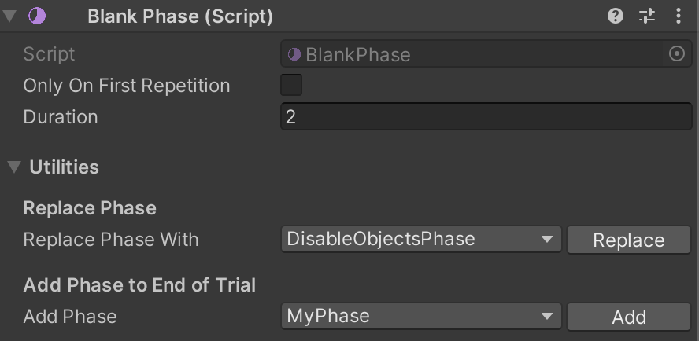
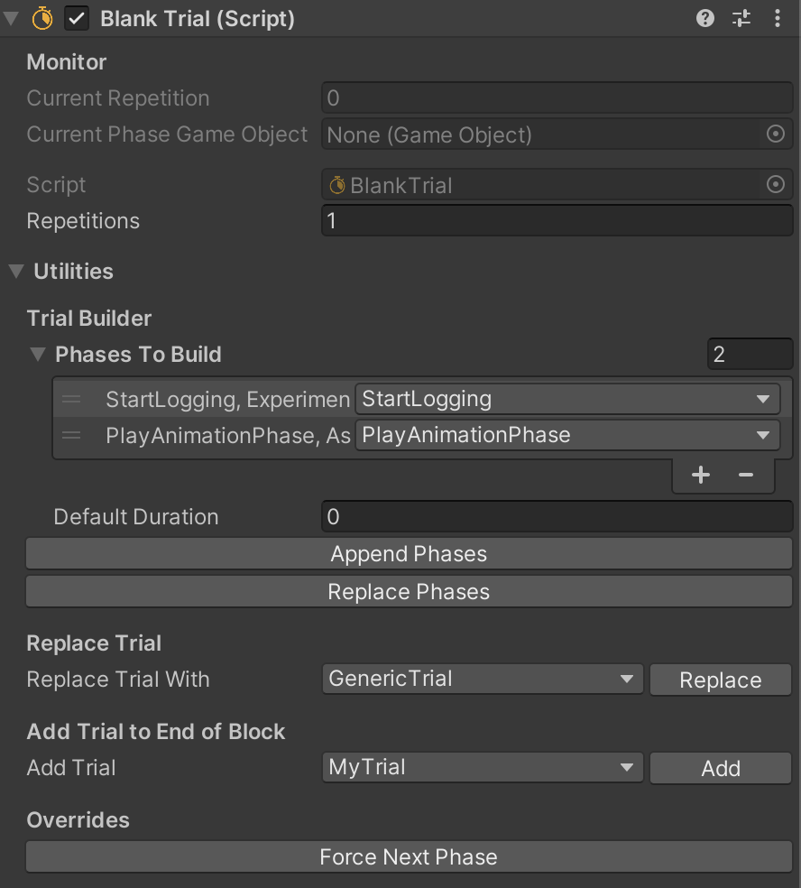
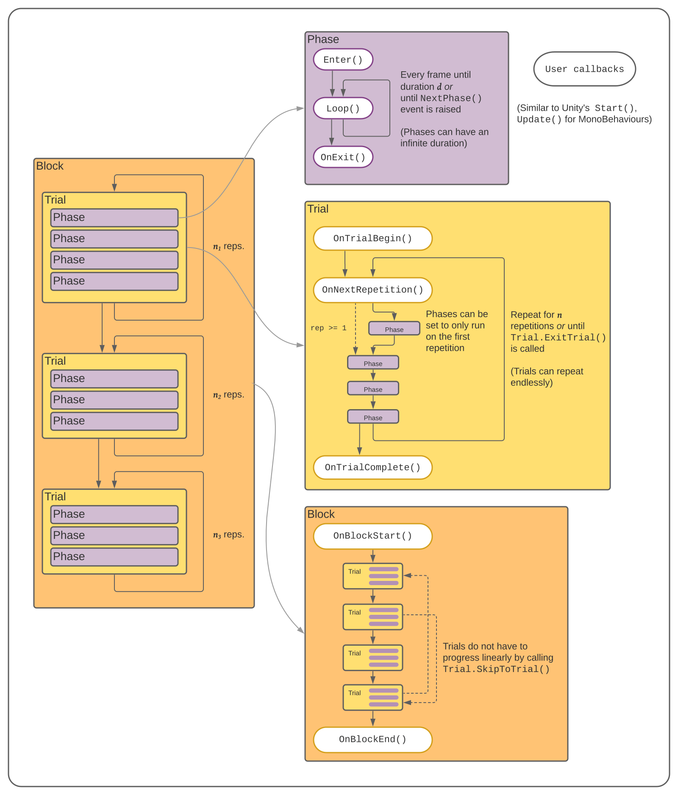

# **Duplo!** - Experiment Structures for User Studies in Unity

[](https://opensource.org/licenses/MIT)

<!-- - [Basic Concepts](#basic-concepts)
- [Install](#install)
- [Configuration](#configuration) -->

<!-- toc -->

## Basic Concepts

Experiment Structures is simply a framework for a finite state machine that exploits Unity's Scene hierarchy for reordering the states and utilizes Unity's component Inspector for configuration. The framework has been used mainly for creating human behavioral experiments (psychophysics) and data collection applications.

The framework has 3 main components: **Block**, **Trial**, and **Phase**. A **Block** contains a series of **Trials**, a **Trial** contains a series of **Phases**. A **Trial** can have many repetitions and a **Phase** can have a finite duration. When put together, an experiment can look like this:

|Block Diagram|Scene Hierarchy|
|---|---|
|||

Rearranging the Phases and Trials can be done by simply dragging the GameObjects around. Duplicating, copying and pasting is only a `Ctrl+D`, `Ctrl+C` and `Ctrl+V` away.

<!-- TODO: gif -->

*If you are looking for a framework that does it all: UI, data logging, structured sessions, analysis, etc. - look at [UXF](https://github.com/immersivecognition/unity-experiment-framework) or [Psychopy](https://psychopy.org/)! (also, if you need millisecond accuracy, look away, Unity is not designed for that stuff!)*

But if you're like me, who likes to implement stuff in their own way, this might be for you! This works best if you already have a "game" in Unity and want a way to control progression in a repeated fashion. I usually build my experiments as a "minigame" first and then tack on Experiment Structures afterwards to control the flow.

### Publications that have used earlier versions of Experiment Structures:

I started this around 2019, and have been adding new features along the way.

|Part of Publication|Publication, Authors, Affiliation, Conference/Journal|
|---|---|
|User studies in VR, data collection|**Haplets: Finger-Worn Wireless and Low-Encumbrance Vibrotactile Haptic Feedback for Virtual and Augmented Reality**, P. Preechayasomboon, E. Rombokas, UW, Frontiers in Virtual Reality, 2021|
|User studies in VR, 2AFC psychophysics|**Chasm: A Screw Based Compact Haptic Actuator**, P. Preechayasomboon, A. Israr, M. Samad, Meta Reality Labs, CHI 2020|
|User studies in VR|Dissertation, David E. Cabellero, UW, 2020|

<hr />

## Install

Experiment Structures doesn't have any dependencies. You have two options: 
- Clone this repo into your `Packages/` directory in your Unity project. This is useful if you want to modify this package to your own liking.
- In the Package Manager, click the **+** sign at the top-left corner and hit `Add package from git URL...`, then enter `https://github.com/prnthp/experiment-structures.git`

Once you've added Experiment Structures, go to **Assets**→**Create Experiment Structures Templates** to add some script templates to your `Asset/ScriptTemplates` directory. After restarting the Editor, you can just right-click in your Project tab and hit **Create**→**Experiment Structures**→**Phase**,**Trial** & **Block** just like you would with a new C# script! All the boilerplate is already added for you!

<!-- TODO: Publish to UPM -->

<hr />

## Usage

Each component is designed to be a single component in a GameObject. All three components are `abstract` classes, meaning that the user must implement their own code with the requisite implementations for each component. This may seem tedious, but it is similar to how Unity's `MonoBehaviours` work. All components are, of course, re-usable. There are also a bunch of utility and example Phases, Trials and Blocks readily available.

All classes are derived from Unity's `MonoBehaviour`, so serialization should work as expected and the structures should play well with Prefabs. Some Unity user callbacks (e.g. `FixedUpdate()`) are available.

### Phase

A Phase can be thought of as a GameObject that automatically starts, loops (think `Update()`) and stops itself. Phases can have a finite duration or loop forever.

```C#
public class MyPhase : Phase // Implement the base class
{
    public GameObject someObject;
    public Light someLight;
    public Trial someOtherTrial;

    public override void Enter()
    {
        someObject.SetActive(true);

        GuaranteeUnityFrameCycle = true; // Optional flag: Make sure Update() is called
    }

    public override void Loop()
    {
        // What you would normally put in Update() can go here
        if (Input.GetKeyUp(KeyCode.F)) { /* Pay Respects */ }

        if (Input.GetKeyUp(KeyCode.Q))
            trial.ExitTrial(); // End the trial prematurely and move on to the next trial

        if (Input.KonamiCodeEntered)
            trial.SkipToTrial(someOtherTrial); // End this trial and start "someOtherTrial" immediately.
    }

    public override void OnExit()
    {
        someLight.enabled = false;
    }
}
```



- Only On First Repetition: the Phase will only run through during the first repetition of the trial
- Duration: In seconds, how long this Phase lasts
  - A negative number indicates that this Phase is to loop indefinitely. An event `NextPhase()`, called using `ExperimentManager.Instance.NextPhase()` is used to exit the Phase. 
  
    This is useful for waiting for stuff to happen, e.g. waiting for the user to respond.

  - Zero indicates that the Phase be run through once: `Enter()`→`Loop()`→`OnExit()`. 
  
    This is useful for firing events or setting things up, e.g. activating a GameObject, spawning a Prefab.

  - The property `GuaranteeUnityFrameCycle`, available only through code, can be set to `true` to ensure that a Phase with zero duration goes through an entire Unity frame *at least* once. 
  
    However, this does not mean that Unity's order of execution is guaranteed, nor is a single frame or a single `Loop()` guaranteed.

- Setting the GameObject holding the Phase to inactive (top-left tickbox in Inspector) will disable the Phase when the Scene is started.

### Trial

A Trial is like a list of Phases. It goes through each child Phase one-by-one according to the order in the hierarchy. A Trial typically has a number of repetitions (minimum is one). An endlessly repeating Trial can also be marked as `Endless` through the property accessible by code.

```C#
public class MyTrial : Trial
{
    public Text someText;
    public Canvas someCanvas;
    
    protected override void OnTrialBegin() // Optional override
    {
        someCanvas.enabled = true;

        Endless = true; // Optional flag: Makes this trial run repeatedly until ExitTrial() is called
    }

    protected override void OnNextRepetition() // Optional override
    {
        someText.text = "Repetition: " + CurrentRepetition; // Starts with the 0th repetition.
    }

    protected override void OnTrialComplete() // Optional override
    {
        Debug.Log("Trial Complete. Yay.");
    }
}
```



- The three methods: `OnTrialBegin()`, `OnNextRepetition()` and `OnTrialComplete()` are all optional. Your class can be entirely blank.
- Trials that have their property `Endless` set to `true` will run repeatedly until the `ExitTrial()` method is called. Phases can access this using `trial.ExitTrial()`, as `trial` refers to its parent Trial.
- Phases can also use the `trial.SkipToTrial()` method to immediately skip to another trial in its parent Block's hierarchy. This can be useful for creating simple menus.
- Setting the GameObject holding the Trial to inactive will disable the Trial when the Scene is started.

### Block

A Block is a container of Trials. Each trial is run through one-by-one according to the order in the hierarchy. The provided `BlankBlock` or `GenericBlock` (that has Unity Events) is most likely enough. Most of the useful stuff are quality of life features accessed through the Inspector.

```C#
public class BlankBlock : Block
{
    protected override void OnBlockStart() {} // Optional

    protected override void OnBlockEnd() {} // Optional
}
```



- **Trials To Shuffle**
  
  In the Trials To Shuffle property, Trials can be added as groups (a group can contain a single Trial). These groups are then shuffled in-place, meaning that the order of the untouched Trials is maintained. You must also specify whether to clock the trials or not, clocking means that the Trial groups are rotated around instead of being randomly shuffled. Shuffling without clocking can result in the same order. Phases and Trials can access access shuffling using `block.ShuffleTrials()`.
  
|`block.ShuffleTrials(clocked=false)`|`block.ShuffleTrials(clocked=true)`|
|---|---|
|||

- **Utilities**
  - The Block Overview has a useful interface to quickly set its Trials repetitions and each Trial's Phases' duration and OnlyOnFirstRepetition properties.

## Utilities

Phases and Trials also have custom Inspectors that contain Utilities as described below (Undo/Redo is supported):

|Phase Utilities|Trial Utilities|
|---|---|
|||
|**Replace Phase**: Replacement with a Phase, will attempt to match serialized properties, name of GameObject will reflect new Phase|**Trial Builder**: Appends or Replaces the Phases in this Trial with the specified Phases in Phases To Build|
|**Add Phases to End of Trial**: *as described*|**Replace Trial**: *as described*, will not attempt to match serialized properties, name of GameObject will reflect new Trial|
||**Add Trial to End of Block**: *as described*|
||**Force Next Phase**: Convenient button for raising the `NextPhase` event when monitoring the Trial|

## Structures Overview

This should help explain some concepts presented above:



## Experiment Manager

The Experiment Manager is a singleton that manages the `NextPhase` event. It will spawn automatically if you have not added one in your Scene. To raise the `NextPhase` event, simply call `ExperimentManager.Instance.RaiseNextPhase()`.

## Data Logger

The Data Logger is a singleton that provides simple data logging in a table-like format. Data Logger has a Datapoints object that is simply a thin wrapper of a `Dictionary<string, string>`. The general workflow is as follows:

```C#
private void SomeInitialMethod()
{
    // Set up the headers
    DataLogger.Instance.keys = new List<string>(new []{"subject", "trial", "repetition", "parameter"});
}

private void SomeMethodLater()
{
    DataLogger.Instance.StartLogging(""); // Can be blank, will use 'yyyy-MM-dd-HH-mm-ss.csv'
    // or
    DataLogger.Instance.StartLogging("my-experiment"); // Will become 'my-experiment-yyyy-MM-dd-HH-mm-ss.csv'
}

private void SetData()
{
    DataLogger.Instance.Datapoints.SetValue("subject", _subjectNum);
    // ... across multiple methods ...
    DataLogger.Instance.Datapoints.SetValue("trial", trial.name);
    // ... across more methods ...
    DataLogger.Instance.Datapoints.SetValue("repetition", trial.CurrentRepetition);
    // ...
    DataLogger.Instance.Datapoints.SetValue("parameter", _reactionTime);
    // ...
    DataLogger.Instance.SetDatapoint("foo", "bar"); // "key", "value"
}

private void EvenLater()
{
    // This will create a row in the table
    DataLogger.Instance.LogState(); // The .csv file is updated at this point
    // ... some time later ...
    SetData();
}

private void Finally()
{
    // This will close 'my-experiment-yyyy-MM-dd-HH-mm-ss.csv'
    DataLogger.Instance.EndLogging();
}
```

Additionally, you can use the provided StartLogging, EndLogging, LogState, and OpenLogDirectory Phases. The Inspector for the Data Logger component also has bunch of useful fields. The Float Format field is used to specify the format when serializing floats, it is simply what you specify when using `Single.toString("F3")`.

The above example could result in a table that looks like this:
| time         | subject | trial | repetition | parameter   |
|--------------|---------|-------|------------|-------------|
| 3.03578E+000 | 1       | 1     | 0          | 1.55142E+00 |
| 5.30343E+000 | 1       | 1     | 1          | 1.67434E+00 |
| 6.84739E+000 | 1       | 2     | 0          | 1.65547E+00 |
| 8.32337E+000 | 1       | 2     | 1          | 1.14001E+00 |

<hr />

## Samples

Use the Samples dropdown in the Package Manager to Install these samples.

### Basic Samples

There are two Scenes provided: FeatureOverview and ColorIntensitySample. FeatureOverview contains a simplistic 2D Scene like the examples above and runs through most of the features available. ColorIntensitySample is a 2AFC experiment with absolutely no forethought on design, but serves as a "looks-like" prototype.

#### FeatureOverview

https://user-images.githubusercontent.com/25041773/149582635-be03815c-5644-4e89-aa97-869ff4eadc2a.mp4


#### ColorIntensitySample

https://user-images.githubusercontent.com/25041773/149561052-f58420d5-77d1-4816-8349-d44397ab03d5.mp4

### AEPsych-driven Samples

Hi Meta folks! AEPsych-driven samples use the AEPsych server for adaptive experimentation provided by the perceptual science folks at Meta Reality Labs. It can shorten the amount of time for perceptual studies significantly!

<!-- TODO: cool gif -->

See [Samples~/AEPsychDriven/](Samples~/AEPsychDriven/)

### VR

The VR Sample is a simple 2AFC button stiffness experiment that you can run in the Editor or on an Oculus Quest/2. It is a simplified version of the experiment described in the paper **Chasm: A Screw Based Compact Haptic Actuator**.

https://user-images.githubusercontent.com/25041773/149437683-63ab998c-17a1-40f2-b126-10adb3e94131.mp4

You will need to [configure your project for VR](https://developer.oculus.com/documentation/unity/unity-conf-settings/) and add the [Oculus Integration](https://assetstore.unity.com/packages/tools/integration/oculus-integration-82022) Asset to your project. Only the `Oculus/VR` folder is required. Choose the OpenXR backend when prompted.

Additional Project Settings:
- Physics
  - Default Contact Offset: 0.001
  - Default Solver Iterations: 12
  - Default Solver Velocity Iterations: 4
  - Solver Type: Temporal Gauss Seidel
- Player
  - Other Settings (Android)
      - Color Space: Linear
      - Untick Auto Graphics API, add Vulkan, move up list to first
      - Scripting Backend: IL2CPP
      - Target Architectures: Only ARM64
- Time
  - Fixed Timestep: 0.005

Alternatively, a complete project file for Unity 2020.3.25f1 is provided here: [TODO](about:blank)

## License

MIT License, otherwise as specified in each file

Copyright © 2021 Jom Preechayasomboon
