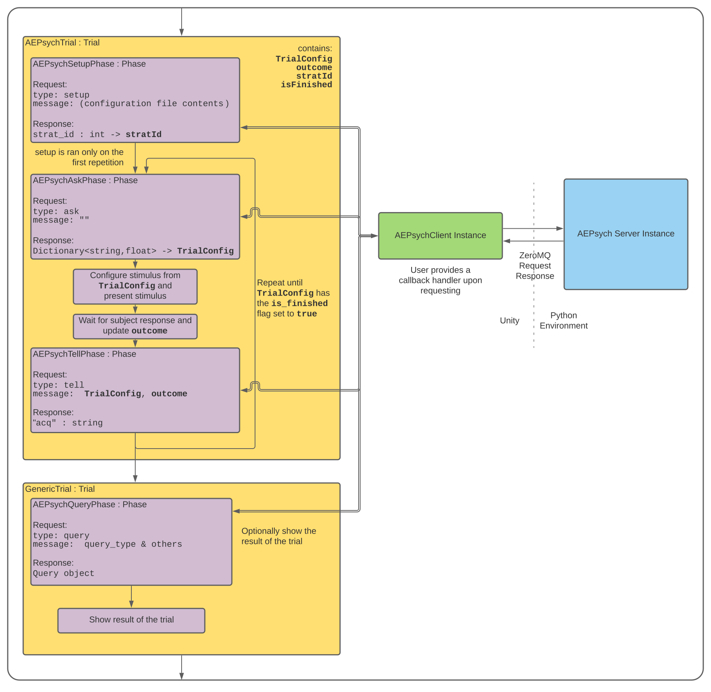

# AEPsych-driven Samples

AEPsych is a framework and library for adaptive experimentation in psychophysics and related domains made by folks at Meta Reality Labs. It is open source and available on GitHub [here](https://github.com/facebookresearch/aepsych).

These samples are driven using an AEPsych server running locally, communicating with Unity via ZeroMQ. Experiment are defined in Unity and sent over to the server, then each trial's configuration is requested from the server, and the outcome is sent back.

## Prerequisites

- [AEPsych](https://github.com/facebookresearch/aepsych/tree/81b6b9385b7d3beec1e053a45813e7299b430bc5) server running in ZeroMQ mode 
    - **Important**: AEPsych is in active development, these examples are based on the specific commit linked ([81b6b9385b](https://github.com/facebookresearch/aepsych/tree/81b6b9385b7d3beec1e053a45813e7299b430bc5)) and has been known to work on that specific state. Unfortunately, the latest commit will most likely be in a broken state. These samples will be updated again once there is an actual release.
    - Install the server in you python environment following the instructions in their repo
    - Launch the server using `python aepsych/server.py --socket_type zmq`
    - Note: You should **not** import AEPsych's Unity client, as it is not suited for our workflow and **not a dependency**.
- [NetMQ](https://www.nuget.org/packages/NetMQ/) for ZeroMQ communication with AEPsych
- [Newtonsoft Json](https://www.newtonsoft.com/json) for serialization

## Installation

Start by installing the prerequisites (NetMQ & Json.NET) - you can use [NuGetForUnity](https://github.com/GlitchEnzo/NuGetForUnity), then install the sample from the Package Manager: Under the package, open the Samples foldout and click Install under AEPsych-driven.

**Important**: Copy the `configs` folder from the imported sample into your `Assets/StreamingAssets` folder.

## Samples
All the samples are in a single scene `AEPsychSamples.unity`. After hitting Play, you can choose from four samples (these mimic some of the samples provided with AEPsych):

1. 1D Threshold Estimation from Single Observations: determine the minimum brightness to see a circle.
1. 1D Optimization from Single Observations: find your optimal 'medium gray' circle
1. 2D Optimization from Single Observations: find your optimal 'indigo' circle among colors with varying red and blue channels (2 dimensions)
1. 3D Optimization from Single Observations: find your optimal 'indigo' circle among colors with varying red, green and blue channels (3 dimensions)

https://user-images.githubusercontent.com/25041773/149590225-a54b8d75-98ba-41a9-8b3d-4c4b7479fba0.mp4

## Components
There are three main components to the AEPsych samples

1. `AEPsychClient.cs`: This is my implementation of AEPsych's Unity client. It maintains the Request/Reply pattern from ZeroMQ by having the user provide a callback for a response for every request. For example, calling `AEPsychClient.AskForNextTrialConfig(...)` requires a callback with parameters `TrialConfig, bool` e.g. `void MyCallback(TrialConfig t, bool isFinished) {}`.

1. `AEPsychTrial.cs`: This class is derived from `Trial` and holds the `TrialConfig`, `isFinished`, and `outcome` properties. Phases would reference this trial by casting from their `trial` property, i.e. `((AEPsychTrial)trial).isFinished = true;`. The trial uses the `Endless` flag, and therefore once `isFinished` is `true`, `ExitTrial()` will be called to end the trial. Simply put, AEPsych has control over the number of trials.

1. `AEPsych(...)Phase.cs` These are a collection of phases that recreates AEPsych's Setup→(Ask→Tell)↺ loop.
    1. `AEPsychSetupPhase.cs` 
    1. `AEPsychAskPhase.cs`
    1. `AEPsychTellPhase.cs`
    1. `AEPsychResumePhase.cs`
    1. `AEPsychSample(...)Phase.cs` other helper Phases to help present stimulus and collect data

Here's a diagram showing how the components work together:

## License
AEPsychClient.cs was adapted from AEPsych's Unity Client, its license is available here: https://github.com/facebookresearch/aepsych/blob/main/LICENSE

The server configurations were copied from https://github.com/facebookresearch/aepsych/tree/main/clients/unity/Assets/StreamingAssets/configs

The rest of the files are subject to the license provided in this repository
